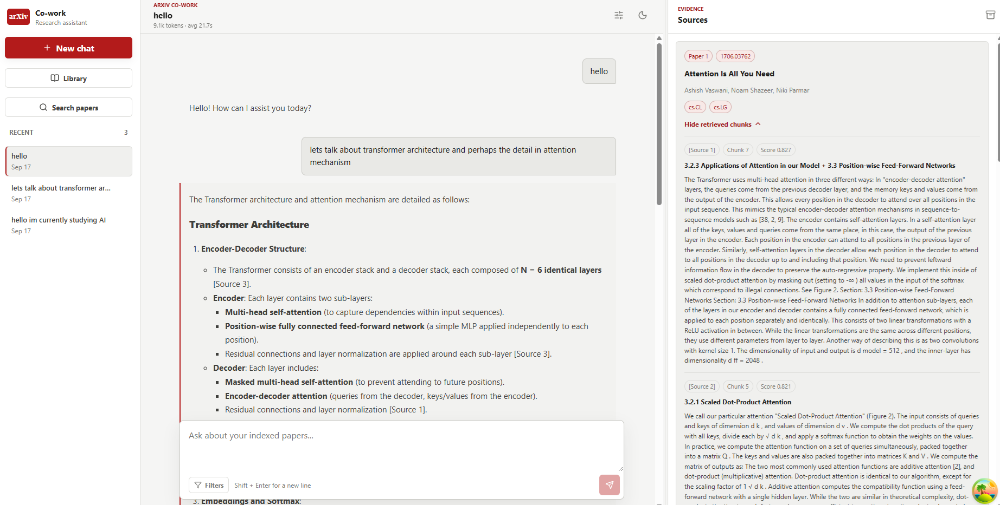
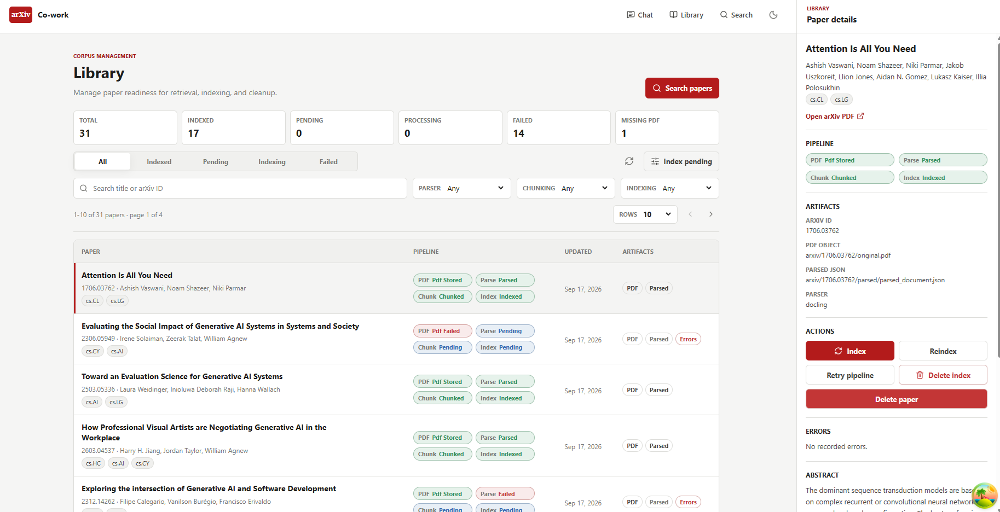
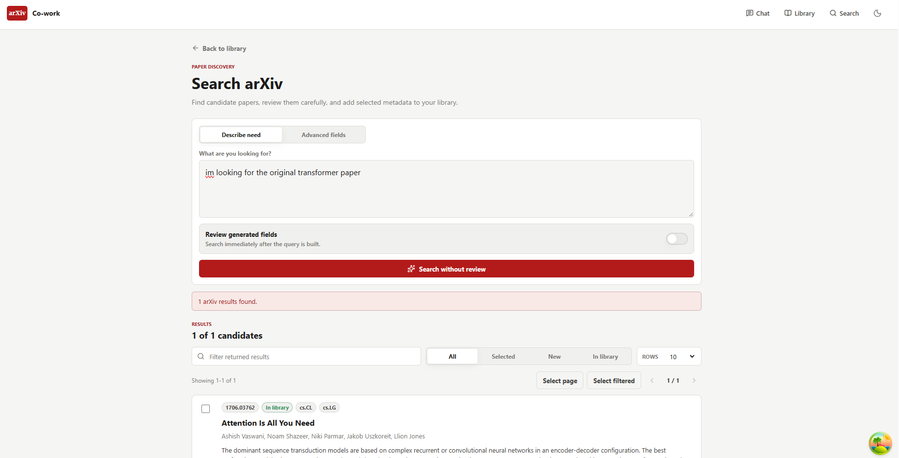
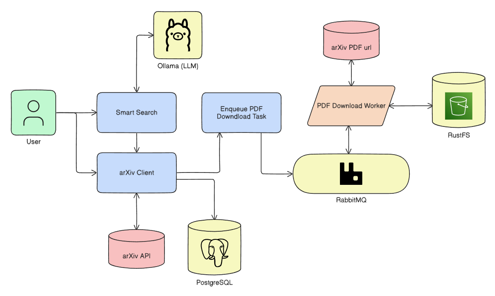
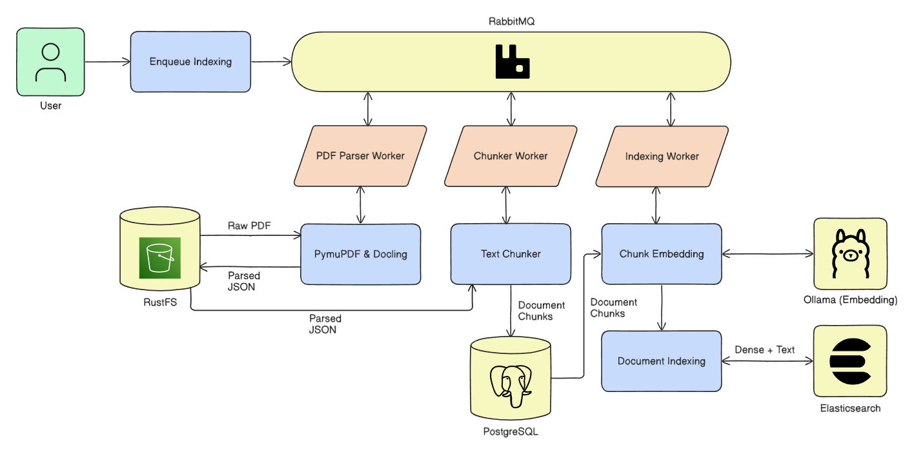
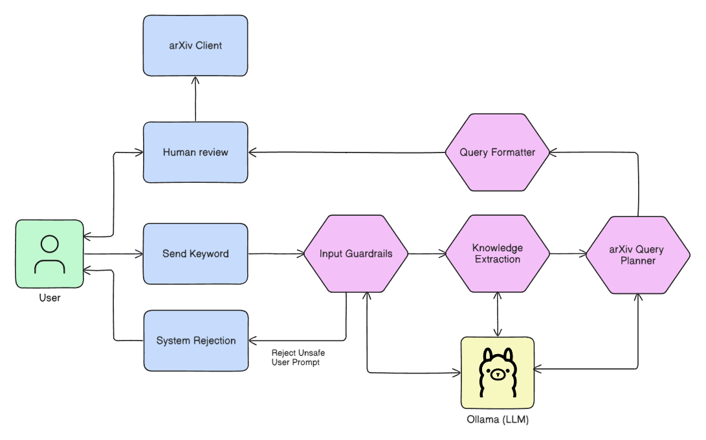
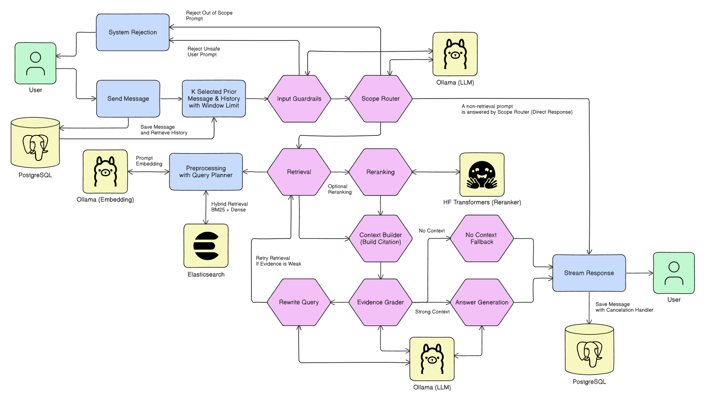

# arXiv CoWork: arXiv Paper Curation Agent

<p align="center">
  
</p>

<p align="center">
  
  
</p>

## System Design

### Data Ingestion Pipeline



The required data for this system would be the paper metadata and PDF file.
Ingestion are also equipped with smart search for effortless arxiv query planner that involves human review before search.

### Document Indexing Pipeline



Right after ingestion is finished, indexing is a step to make all the documents searchable by the agent later, the underlying process invloves several steps:
1. Parser: parse pdf files into JSON schema
2. Chunker: split 1 document into smaller chunks
3. Embedding: build the dense representation of each document chunks
4. Indexing: the insertion process to the search database

Each steps can take an unpredictable amount of time and prone to failures, this way asynchronous system are designed.

## Agent Design

### Smart Search



Smart search is a part of the ingestion pipeline for effortless arXiv API query planner, the graph is pretty straight forward here, the important steps are:
1. Knowledge Extraction: let the model guess the paper keyword based on what the user request
2. arXiv Query Planner: the extracted knowledge becomes the planner input, here is where the final query plan is built

### Assistant (Core Agent)



The assistant is pretty good for a baseline, it handles most conversation features such as:
1. Preventing prompt injection and check for requested scope
2. Both direct response and retrieval with extended thinking
3. Collecting message history within the conversation room
4. Providing citation source of its generated answer
5. Self evaluation by evidence grading

Since the underlying design required multiple LLM calls, most scope are optimized by prompt engineering and limited amount of output tokens count.

## Tech Stack

The current system are implemented with the provided tools below:
- FastAPI: Server side endpoint
- React: Client side interface
- PostgreSQL (with SQLAlchemy & Alembic): Main database for source of truth
- RustFS: Object storage for storing paper PDF Files
- Elasticsearch: Hybrid search database (enable both text and dense retrieval)
- RabbitMQ: Message queue for asynchronous indexing pipeline task
- Celery: Message queue worker for consuming indexing task
- Ollama: Local inference for both LLM and Embedding model
- Huggingface Transformers: Running evidence Reranker model
- LangGraph: Building agent graph for core orchestration
- PymuPDF & Docling: PDF Parser Package

Unimplemented Tools (coming soon):
- LangFuse: Orchestration obeservability
- Ragas: RAG evaluation framework (Context Recall, Context Precision, Faithfulness, Answer Relevancy)

## Installing Packages

The package is registered in the file `pyproject.toml`, running the command below will install the required package automatically:
```powershell
pip install -e .
```

## Required Infrastructure

Most of the infrastructure are built using docker, check `compose.yaml` for the registered containers, running the command below will build all the required infrastructure:
```powershell
docker compose up -d
```

To stop the containers, run the command below and add `-v` if you consider dropping the data volumes:
```powershell
docker compose down -d
```

## Local Inference using Ollama (AI Models)

The model used for this project experiment is provided below:
- LLM: Qwen3-8B 4-bit
- Embedding: Qwen3-Embedding-0.6B FP16
- Reranker: Qwen3-Reranker-0.6B FP16

Note that the reranker is not a part of Ollama, and its resource usage is included because we're running the reranker seperately with huggingface transformers built inside the system.

The choice of the model should be considered based on your local hardware capabilities.

Starting the Ollama instance locally, simply running this command below:
```powershell
ollama serve
```

Check all available models inside your system, you might want to install the required models to begin:
```powershell
ollama list
```

Install the model locally by pulling the model to your system, don't forget to exclude the reranker:
```powershell
ollama pull <model_name>
```

After sucessfully pulling the models, test the inference through your CLI:
```powershell
ollama run <model_name>
```

## Database Integration:

To integrate the system with SQL database as the source of truth, the packages we'll be using are:
- SQLAlchemy: The SQL ORM for the database interaction
- Alembic: Database migration are fully handled by this package

For further guide about migration, the docs is available at `/alembic/migrations.md`

## Run the app locally

### 1. Running the FastAPI Server:

The server side of the system are implemented with FastAPI with PyDantic Models, pretty straightforward implementation for any kinds of AI system.

Terminal 1, running the backend server

```powershell
uvicorn --app-dir src server.main:app --reload --host 0.0.0.0 --port 8000
```

Api docs will be available at: http://localhost:8000/docs (coming soon)

### 2. Running Celery Workers:

The indexing pipeline is designed to be fully asynchronous because its fully involving multi-step preprocessing that takes unpredictable amount of time, a lot of moving parts, and prone to failures.

The system require a total of 4 workers to enable indexing process, although the worker is optional if you don't do any indexing task at all (still required when indexing paper for the very first time).

To all four workers using the powershell script:
```powershell
.\scripts\run-workers.ps1
```

Or run them manually seperately:

Terminal 2, running the pdf download worker
```powershell
$env:PYTHONPATH="src"
celery -A worker.celery_app:celery_app worker -Q paper.pdf_download --pool=solo --loglevel=info -n pdf-download@%h
```

Terminal 3, running the parser worker
```powershell
$env:PYTHONPATH="src"
celery -A worker.celery_app:celery_app worker -Q paper.parsing --pool=solo --loglevel=info -n parsing@%h
```

Terminal 4, running the chunker worker
```powershell
$env:PYTHONPATH="src"
celery -A worker.celery_app:celery_app worker -Q paper.chunking --pool=solo --loglevel=info -n chunking@%h
```

Terminal 5, running the embedding+indexing worker
```powershell
$env:PYTHONPATH="src"
celery -A worker.celery_app:celery_app worker -Q paper.indexing --pool=solo --loglevel=info -n indexing@%h
```

### 3. Running The React App:

The interface are fully built using react with typescript, simply run this command to run the app:
```powershell
cd app
npm run dev
```

## LICENSE

This project is licensed under the MIT License. See [LICENSE](LICENSE) file for details.

